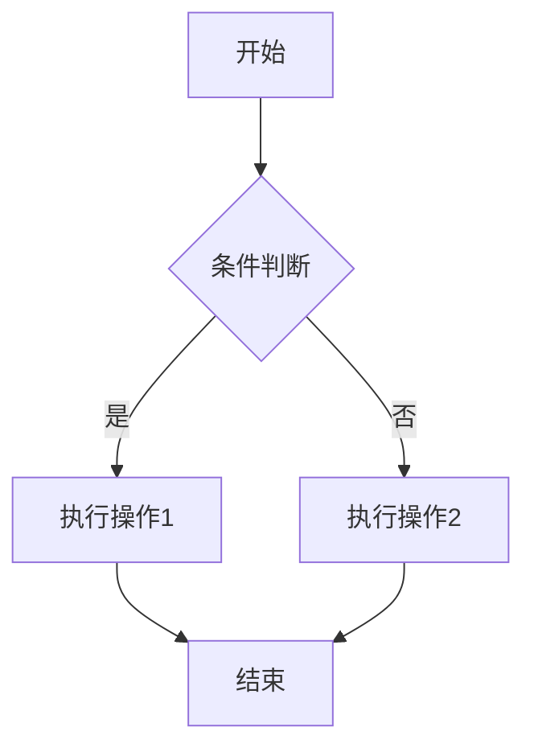
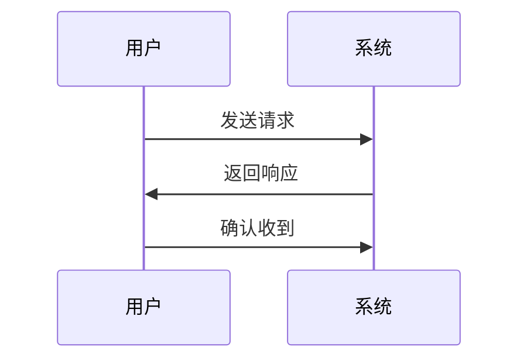
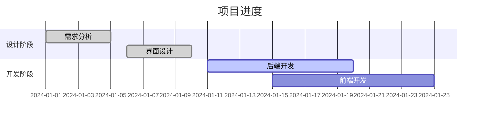
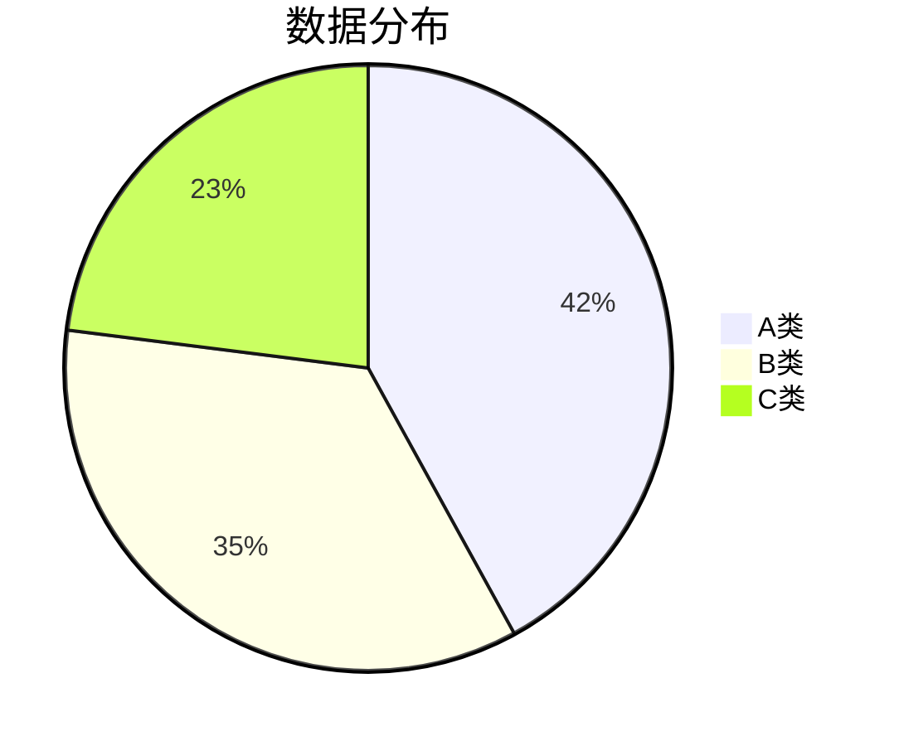
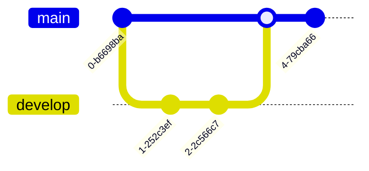
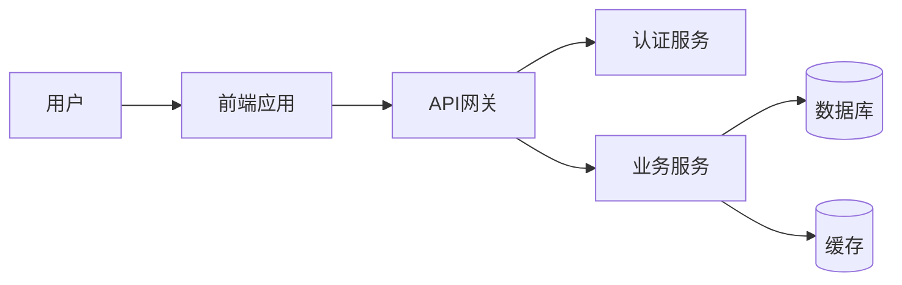
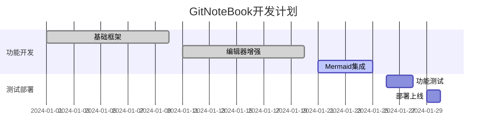

# GitNoteBook - Mermaid图表集成演示

这个文档展示了GitNoteBook中新增的Mermaid图表功能和笔记详情页功能。

## 🆕 新功能介绍

### 1. 笔记详情页
- **GitHub Issues风格**：完全仿照GitHub Issues的详情页体验
- **查看模式**：点击笔记列表中的笔记，先进入详情页查看
- **评论功能**：可以在详情页查看和发表评论
- **编辑按钮**：从详情页点击"编辑"按钮进入编辑模式
- **导航优化**：列表 → 详情 → 编辑的标准GitHub流程

### 2. Mermaid图表集成
支持多种图表类型，包括：

## 📊 支持的图表类型

### 流程图 (Flowchart)

### 时序图 (Sequence Diagram)

### 甘特图 (Gantt Chart)

### 饼图 (Pie Chart)

### Git图 (Git Graph)

## 🎯 使用方法

### 在编辑器中插入图表
1. 点击工具栏中的 **📊 Mermaid图表** 按钮
2. 从下拉菜单中选择图表类型
3. 系统会自动插入对应的模板代码
4. 编辑图表内容
5. 切换到预览模式查看渲染效果

### 工具栏功能
- **流程图**：适用于业务流程、算法逻辑
- **时序图**：适用于系统交互、API调用
- **甘特图**：适用于项目管理、进度规划
- **饼图**：适用于数据分析、比例展示
- **Git图**：适用于版本控制、分支管理

## 🚀 技术特性

### 智能渲染
- **主题适配**：自动适配深色/浅色主题
- **响应式设计**：图表自动适应容器大小
- **错误处理**：语法错误时显示友好提示
- **性能优化**：仅在内容变化时重新渲染

### GitHub集成
- **评论系统**：直接使用GitHub Issues的评论API
- **权限控制**：基于GitHub Token的访问控制
- **实时同步**：评论和内容实时同步到GitHub

### 编辑体验
- **语法高亮**：Mermaid代码块支持语法高亮
- **一键复制**：代码块支持一键复制功能
- **快捷插入**：工具栏快捷插入常用图表模板

## 📝 示例场景

### 软件架构设计

### 项目管理

## 🎉 总结

GitNoteBook现在支持完整的GitHub Issues体验，包括：
- ✅ 笔记详情页查看
- ✅ 评论功能
- ✅ Mermaid图表渲染
- ✅ 多种图表类型
- ✅ 深色主题适配
- ✅ 响应式设计

这些功能让GitNoteBook成为了一个真正专业的GitHub-based笔记应用！ 